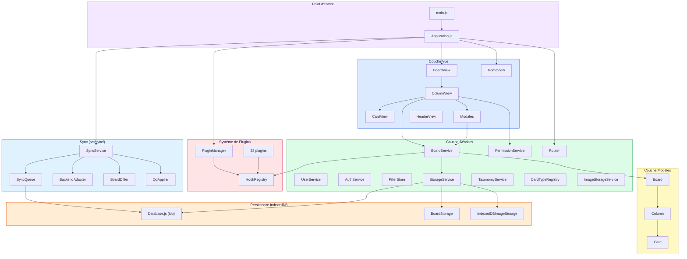
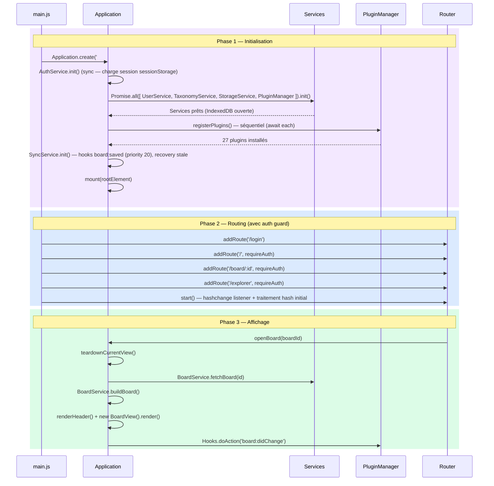
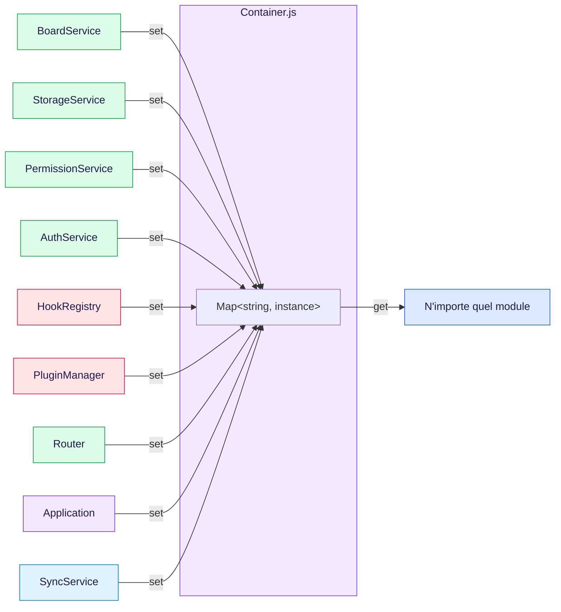
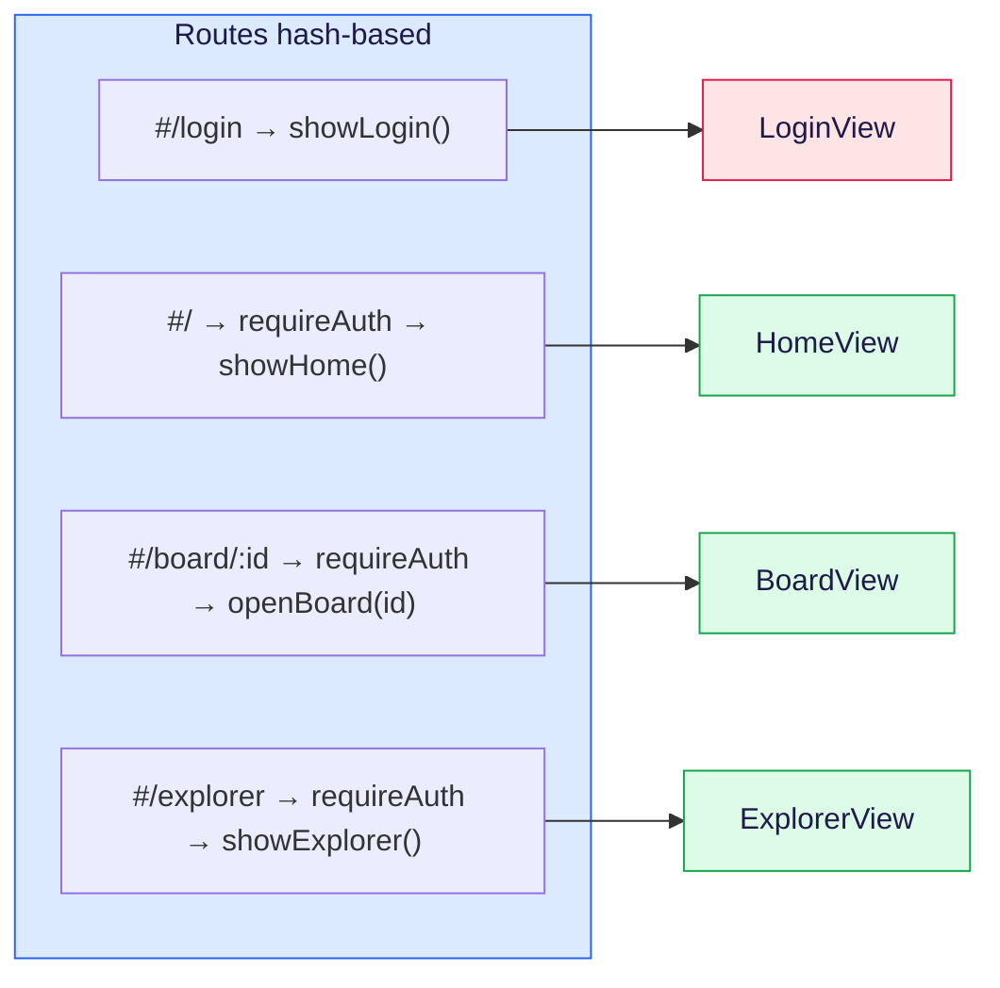

# Architecture Globale

> Vue d'ensemble du projet Kanban : couches, initialisation, navigation et conventions.

**Docs connexes** : [Plugin System](./PLUGIN-SYSTEM.md) | [Data Models](./DATA-MODELS.md) | [Views & UI](./VIEWS-UI.md)

---

## Couches applicatives



---

## Séquence de démarrage

L'application s'initialise en 3 phases synchronisées :



**Fichiers clés** :
- [`src/main.js`](../src/main.js) — Bootstrap, routes, lancement
- [`src/Application.js`](../src/Application.js) — Orchestrateur singleton
- [`src/services/Router.js`](../src/services/Router.js) — Routeur hash-based (`#/login`, `#/`, `#/board/:id`, `#/explorer`)
- [`src/services/AuthService.js`](../src/services/AuthService.js) — Authentification front-end (login, session, guard)

---

## Container (Service Locator)

Tous les singletons sont enregistrés dans un Container léger pour injection et tests.



**Pattern** : chaque service s'enregistre lui-même en fin de fichier :
```js
const boardService = new BoardService();
Container.set('BoardService', boardService);
export default boardService;
```

**Fichier** : [`src/Container.js`](../src/Container.js) — `get(name)`, `set(name, instance)`, `has(name)`, `reset()`

---

## Navigation & Routes



**Cycle de navigation** : `hashchange` → `Router._handleCurrentHash()` → match → `requireAuth` guard → `Application.openBoard(id)` (ou `showHome()`)

**Auth guard** (mode multi uniquement) : les routes `/`, `/board/:id` et `/explorer` sont wrappées par `requireAuth()`. Si `AuthService.isAuthenticated()` retourne `false`, l'URL cible est mémorisée et l'utilisateur est redirigé vers `/login`. En mode solo, le guard est transparent.

A chaque changement de vue, `Application._teardownCurrentView()` :
1. Détruit le header
2. Révoque les Object URLs (images)
3. `currentView.destroy()`
4. Vide le container DOM
5. Reset `_currentBoard` / `_currentBoardId`

---

## Conventions du projet

| Convention | Exemple |
|---|---|
| Classes | `PascalCase` — `BoardService`, `ColumnView` |
| Méthodes / variables | `camelCase` — `removeColumn()`, `targetColumnId` |
| Propriétés privées | `_prefixUnderscore` — `this._board` |
| Fichiers classes | `PascalCase.js` — `BoardView.js` |
| Fichiers utilitaires | `camelCase.js` — `backgroundImage.js` |
| Hooks core | `domaine:action` — `board:rendered`, `card:moved` |
| Hooks plugins | `pluginName:action` — `boardNotes:created` |
| Singletons | Export default + `Container.set()` |

---

## Mode Solo-Offline

L'application fonctionne en mode **solo-offline** : un seul utilisateur local emule cote front.

**Flag de mode** : [`src/config/appMode.js`](../src/config/appMode.js) — `isSoloMode()` retourne `true` en mode solo, `false` en multi.

**Comportement en solo** :
- `UserService` cree un seul user admin (`solo-user`) dont le profil est stocke en IndexedDB (cle `userProfile`)
- `getUserById(id)` retourne le solo user pour **tout** ID non-null (compatibilite boards existants)
- Les elements UI multi-user sont caches (SelectUser, filtres assignee/auteur, badges assignee)
- Un onglet "Profil" dans ModalBoardSettings permet de configurer nom, initiales et couleur

**Passage en multi** : changer `APP_MODE` en `'multi'` dans `appMode.js` (ou lire `import.meta.env.VITE_APP_MODE`).

---

## Génération d'identifiants

Tous les identifiants d'entités (board, colonne, carte, commentaire, image, note, règle, champ, item) sont générés via une **factory centralisée** :

**Fichier** : [`src/utils/id.js`](../src/utils/id.js) — `generateId(prefix)`, `setIdGenerator(fn)`

```js
import { generateId } from '../utils/id.js';

const cardId   = generateId('card');    // → "card-a1b2c3d4"
const boardId  = generateId('board');   // → "board-e5f6g7h8"
```

**Préfixes utilisés** : `board`, `col`, `card`, `comment`, `img`, `note`, `rule`, `cf`, `item`

**Compatibilité backend** : appeler `setIdGenerator(fn)` au démarrage pour remplacer la génération locale par des IDs serveur (UUID v4, auto-increment, etc.).

---

## Arborescence src/

```
src/
├── main.js                          ← Bootstrap
├── Application.js                   ← Orchestrateur
├── Container.js                     ← Service Locator
├── models/                          ← Données pures (EventEmitter)
├── services/                        ← Logique métier + persistence
│   └── storage/                     ← IndexedDB (idb wrapper)
├── views/                           ← DOM, modales, interactions
│   ├── column/                      ← Sous-composants colonne
│   ├── cardDetail/                  ← Panneaux détail carte
│   └── boardSettings/               ← Panneaux settings board
├── sync/                            ← Sync backend (SyncService, SyncQueue, adapters)
├── plugins/                         ← Système de hooks
│   ├── lib/                         ← Factories (Color, Taxonomy)
│   └── registry/                    ← 27 plugins
├── components/                      ← Widgets réutilisables
├── styles/                          ← SCSS (variables, mixins, composants)
├── utils/                           ← Helpers purs
├── lib/                             ← EventEmitter
├── config/                          ← Constantes (historyActions, appMode)
└── data/                            ← Board de démo
```
