# Data Models & Storage

> Modeles de donnees, systeme d'evenements et persistence IndexedDB.

**Docs connexes** : [Architecture](./ARCHITECTURE.md) | [Plugin System](./PLUGIN-SYSTEM.md) | [Views & UI](./VIEWS-UI.md)

---

## Graphe des modeles

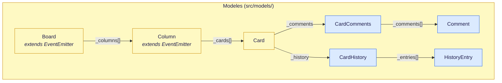

---

## Board

Conteneur racine du plateau. Emet `'change'` a chaque mutation et relaie les `'change'` de ses colonnes (bubbling).

**Fichier** : [`src/models/Board.js`](../src/models/Board.js)

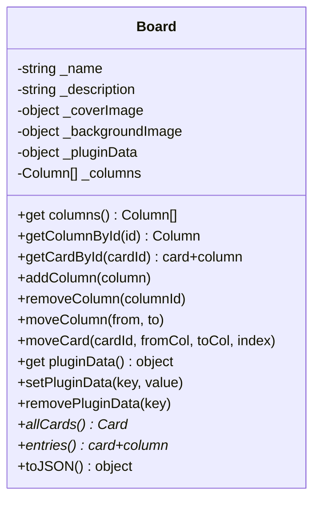

**Points cles** :
- `columns` getter retourne une **copie** du tableau (immutabilite externe)
- `pluginData` getter retourne une **copie shallow** de `_pluginData` (lecture safe)
- `setPluginData(key, value)` : mutation safe avec `emit('change')` → auto-save
- `removePluginData(key)` : suppression safe avec `emit('change')` → auto-save
- `_onColumnChangeBound` : handler unique branche sur chaque Column pour le bubbling
- `removeColumn()` fait `column.off('change', ...)` avant de supprimer (cleanup)

---

## Column

Liste ordonnee de Cards. Emet `'change'` a chaque mutation (add, remove, move, rename).

**Fichier** : [`src/models/Column.js`](../src/models/Column.js)

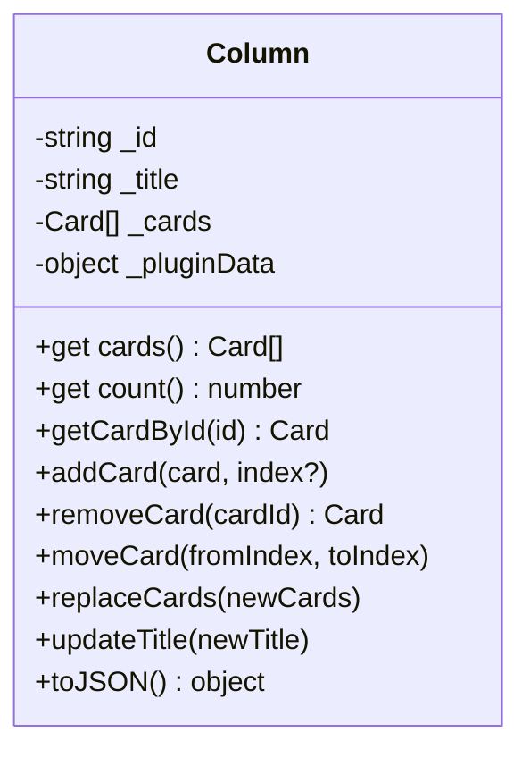

**Points cles** :
- `cards` getter retourne une **copie** (pas de mutation externe)
- `replaceCards()` : remplacement bulk en une seule emission `'change'` (utilise par la migration de colonnes)
- `_pluginData` : donnees par colonne (ex: couleur de colonne)

---

## Card

Objet de donnees pur (pas d'EventEmitter). Contient l'historique et les commentaires.

**Fichier** : [`src/models/Card.js`](../src/models/Card.js)

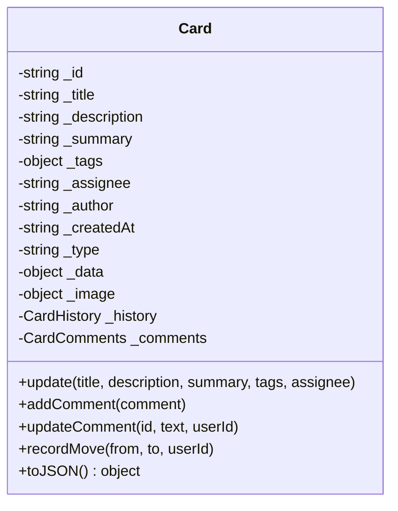

**Points cles** :
- `_type` : `'standard'` ou `'widget:*'` (carte speciale geree par un plugin)
- `_summary` : texte court affiché entre le titre et la description sur la carte
- `_tags` : multi-taxonomie `{ priority: ['high'], type: ['feature', 'ux'] }`
- `_data` : donnees libres pour les widgets (ex: compteur, config YouTube)
- `_image` : reference IndexedDB `{ id: string }`
- Tous les getters retournent des **copies** (deep clone pour `tags`)

---

## Comment

Entite representant un commentaire sur une carte. Peut contenir des fichiers joints.

**Fichier** : [`src/models/Comment.js`](../src/models/Comment.js)

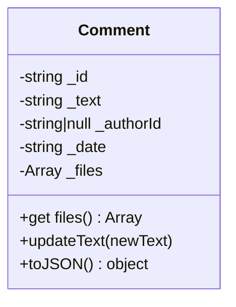

**Points cles** :
- `_files` : tableau de fichiers joints `[{ id, name, size, mimeType }]`
- Backward-compatible : anciens commentaires sans `files` recoivent `[]`
- `files` getter retourne une **copie** defensive du tableau
- Les blobs sont stockes dans IndexedDB via StorageService (meme store que les images)

---

## CardComments

Collection de commentaires d'une carte. Encapsule le CRUD et la serialisation.

**Fichier** : [`src/models/CardComments.js`](../src/models/CardComments.js)

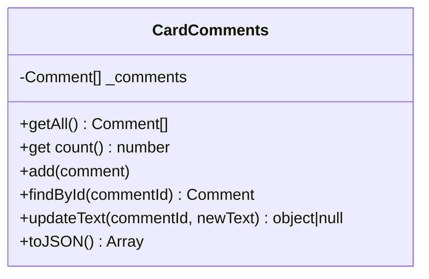

**Points cles** :
- `getAll()` retourne une **copie** du tableau (isolation memoire)
- `updateText()` retourne `{ oldText, comment }` pour que CardHistory puisse enregistrer le diff
- Le constructeur reconstruit des instances `Comment` depuis les donnees brutes (restauration IndexedDB)

---

## HistoryEntry

Value object totalement immuable representant une action dans l'historique d'une carte.

**Fichier** : [`src/models/HistoryEntry.js`](../src/models/HistoryEntry.js)

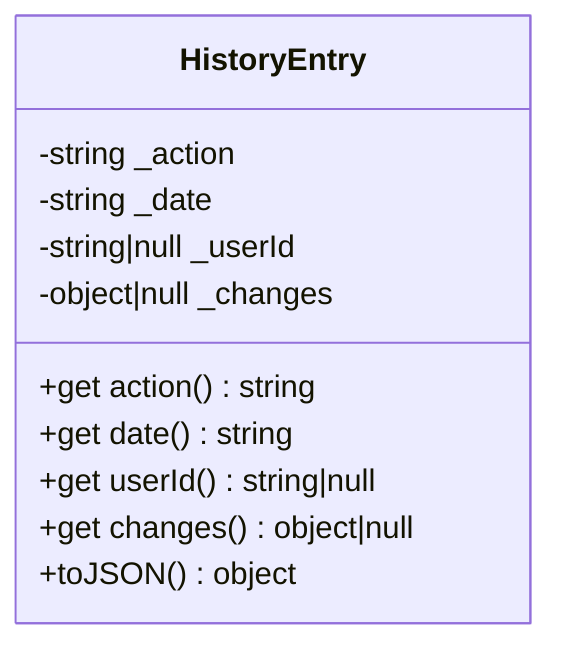

**Points cles** :
- `_action` : type d'action (`'created'`, `'updated'`, `'moved'`, `'commented'`, `'comment_edited'`, `'reordered'`)
- `_changes` : format standard `{ field: { from, to } }` (ex: `{ title: { from: 'A', to: 'B' } }`)
- `_date` : auto-generee si absente

---

## CardHistory

Timeline d'une carte. Encapsule le tableau d'HistoryEntry et fournit des raccourcis types pour chaque type d'action.

**Fichier** : [`src/models/CardHistory.js`](../src/models/CardHistory.js)

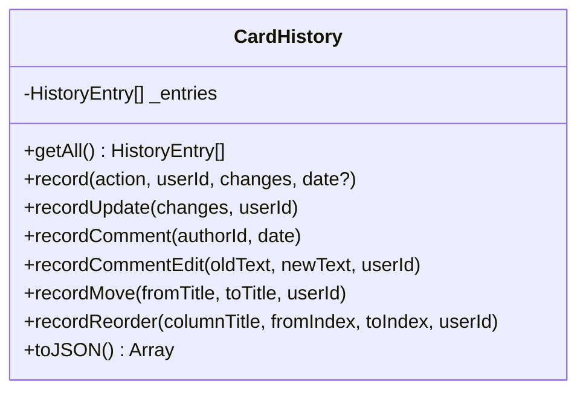

**Points cles** :
- Deux chemins de construction : nouvelle carte (cree automatiquement l'entree `'created'`) ou restauration depuis des donnees brutes
- `recordUpdate()` ignore les diffs vides (pas de pollution historique)
- `recordReorder()` convertit les index 0-based en positions 1-based pour l'affichage
- `getAll()` retourne une **copie** du tableau

---

## Systeme d'evenements

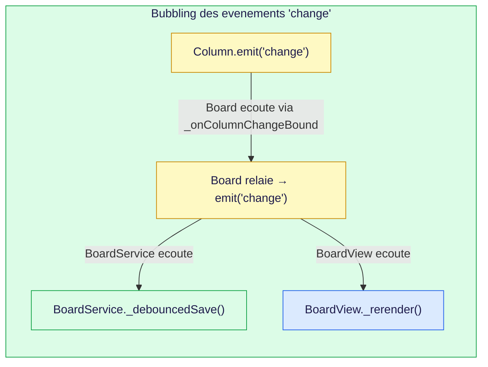

**EventEmitter** : [`src/lib/EventEmitter.js`](../src/lib/EventEmitter.js) — micro implementation `on()`, `off()`, `emit()`

**Flux** :
1. Une mutation sur Column (ex: `addCard`) emet `'change'`
2. Board relaie en emettant son propre `'change'`
3. **BoardService** ecoute → debounce 300ms → `save()` dans IndexedDB
4. **BoardView** ecoute → `_rerender()` (detruit + reconstruit toutes les ColumnView)

---

## Persistence IndexedDB

Aucun `localStorage` — tout est dans IndexedDB via la librairie `idb`. Version actuelle : **DB_VERSION 2**.

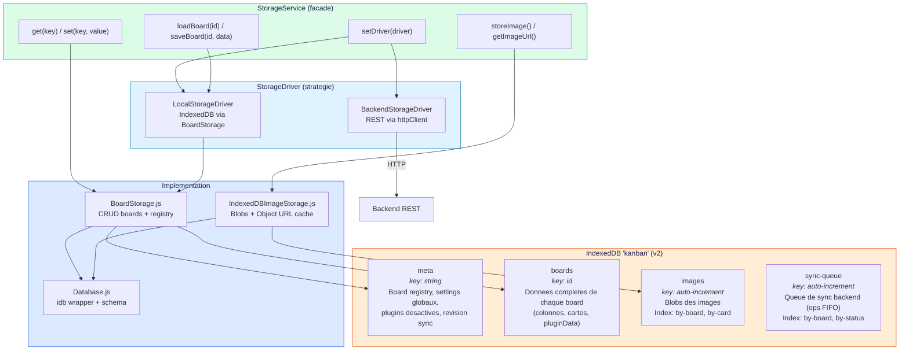

### StorageDriver (pattern strategie)

`StorageService` delegue les operations board a un driver interchangeable via `setDriver(driver)` :

| Driver | Source | Usage |
|---|---|---|
| `LocalStorageDriver` (defaut) | IndexedDB via BoardStorage | Mode offline / BackendPlugin desactive |
| `BackendStorageDriver` | REST via httpClient | BackendPlugin actif et utilisateur connecte |

Les **settings** (`get/set/remove`) et les **images** restent toujours en IndexedDB local, seules les operations board changent de source.

Le **board actif** est stocke comme setting local (`storage:activeBoard`) dans le store meta, independant du driver. Migration automatique depuis l'ancien `registry.activeBoard` au premier acces.

**Fichiers** :
- [`src/services/StorageService.js`](../src/services/StorageService.js) — Facade unifiee (tout async) + driver
- [`src/services/storage/StorageDriver.js`](../src/services/storage/StorageDriver.js) — Interface abstraite (7 methodes board-only)
- [`src/services/storage/LocalStorageDriver.js`](../src/services/storage/LocalStorageDriver.js) — Wrap BoardStorage (IndexedDB)
- [`src/services/storage/BackendStorageDriver.js`](../src/services/storage/BackendStorageDriver.js) — Pur REST via httpClient
- [`src/services/storage/Database.js`](../src/services/storage/Database.js) — Ouverture IndexedDB, schema, migrations
- [`src/services/storage/BoardStorage.js`](../src/services/storage/BoardStorage.js) — CRUD boards, registry, settings
- [`src/services/storage/IndexedDBImageStorage.js`](../src/services/storage/IndexedDBImageStorage.js) — Blobs avec Object URL caching
- [`src/services/storage/ExportImportService.js`](../src/services/storage/ExportImportService.js) — Export/import JSON avec images base64

---

## Flux de sauvegarde

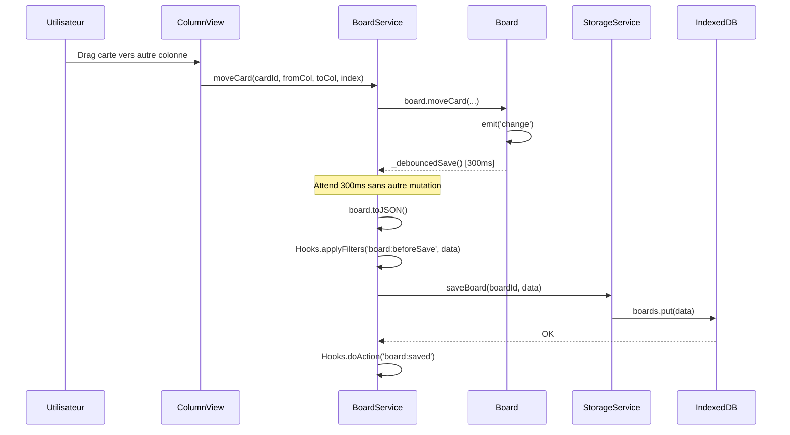

**Points cles** :
- Le debounce de 300ms evite les saves multiples lors de mutations rapides
- `board:beforeSave` permet aux plugins de transformer les donnees avant persistence
- `_savePending` permet `flush()` avant fermeture de tab
- `pauseAutoSave()` / `resumeAutoSave()` : utilise par LiveSyncPlugin pendant la sync

---

## Multi-Board

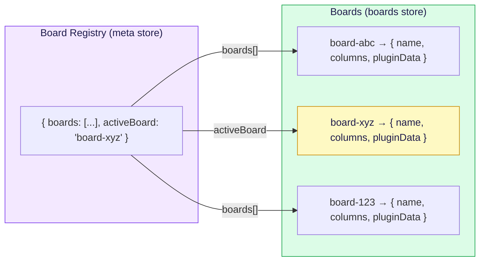

Chaque entree du registre contient : `{ id, name, createdAt, updatedAt, columnCount, cardCount }`

Operations : `createBoard()`, `deleteBoard()`, `duplicateBoard()`, `renameBoard()`, `setActiveBoard()`

---

## Images

Les images sont stockees comme Blobs dans IndexedDB avec des index pour recherche rapide.

| Index | Usage |
|---|---|
| `by-board` | Recuperer toutes les images d'un board (cleanup) |
| `by-card` | Recuperer l'image d'une carte specifique |

**Object URL caching** : `IndexedDBImageStorage._urlCache` (Map) evite de recreer des Object URLs a chaque acces. `revokeAllUrls()` est appele a chaque changement de vue pour eviter les memory leaks.

---

## Sync Queue (store `sync-queue`)

Queue FIFO persistante utilisee par SyncService pour envoyer les operations au backend. Ajoutee en DB_VERSION 2.

**Schema d'une entree :**

| Champ | Type | Description |
|---|---|---|
| `id` | `number` | Auto-increment (FIFO naturel) |
| `boardId` | `string` | ID du board concerne |
| `ops` | `Array` | Operations issues de BoardDiffer.diff() |
| `status` | `string` | `'pending'`, `'sending'` ou `'failed'` |
| `retryCount` | `number` | Nombre de tentatives echouees |
| `createdAt` | `number` | Timestamp de creation (Date.now()) |
| `error` | `string\|null` | Dernier message d'erreur |

**Index :**

| Index | Usage |
|---|---|
| `by-board` | Recuperer les entrees d'un board specifique |
| `by-status` | Recuperer les entrees par statut (recovery stale) |

**Machine d'etat :**

```
pending ──dequeue()──► sending ──ack()──► (supprime)
                          │
                        nack()
                          │
                          ▼
                       failed (retryCount < 5 → repasse pending)
```

**Fichier** : [`src/sync/SyncQueue.js`](../src/sync/SyncQueue.js)

---

## Metadata de revision sync

Le SyncService stocke la revision serveur de chaque board dans le store `meta`.

| Cle | Format |
|---|---|
| `sync:board:{boardId}:revision` | `{ serverRevision: number, lastSyncedAt: number }` |
