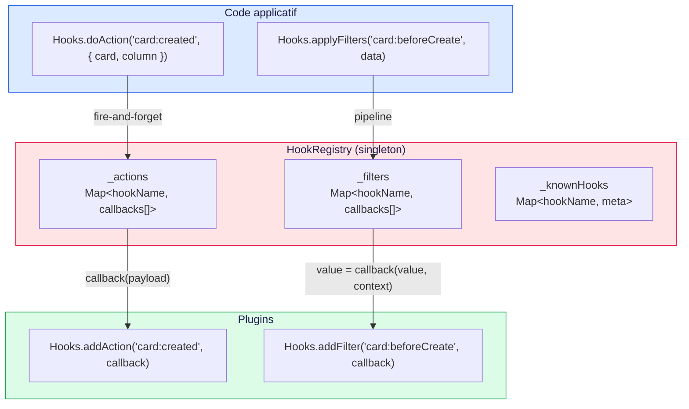
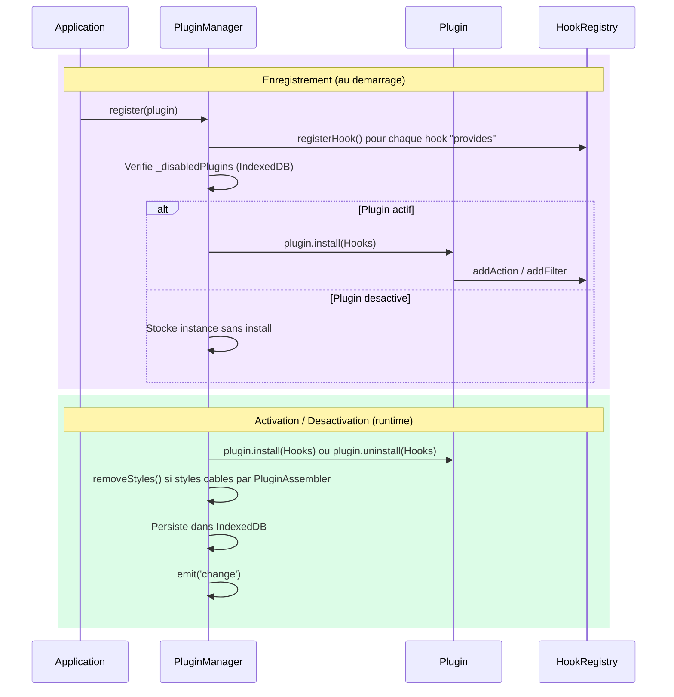
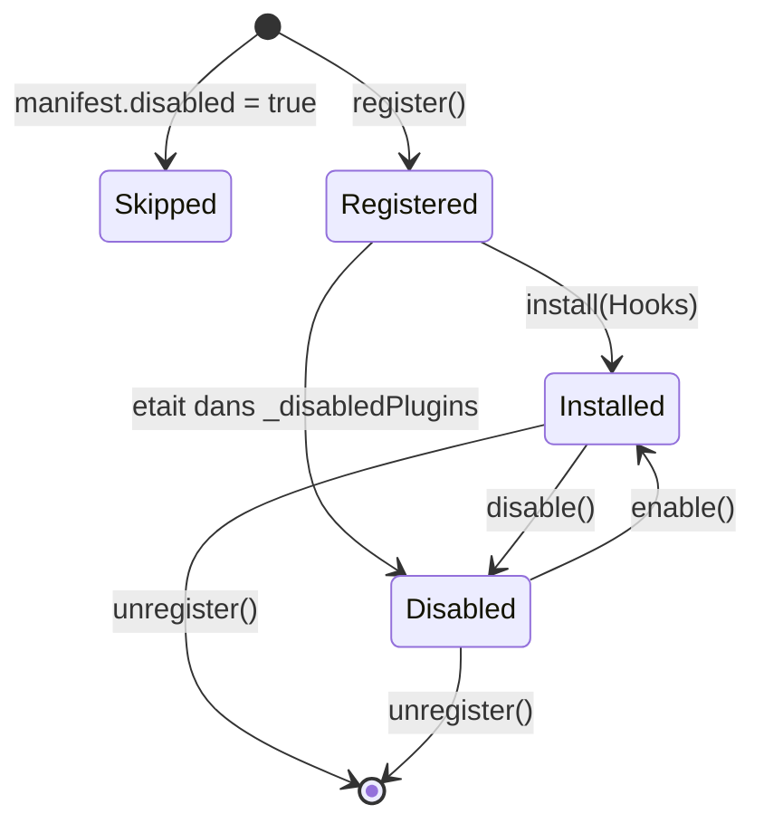
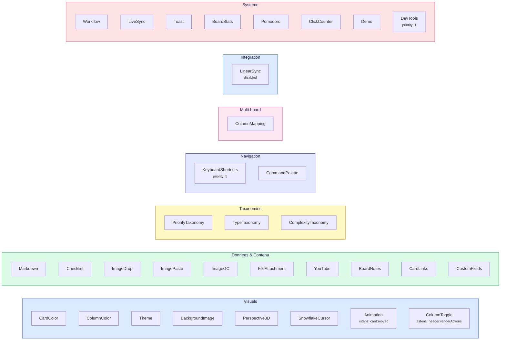

# Systeme de Plugins

> Hooks, cycle de vie des plugins, et guide pour en creer un nouveau.

**Docs connexes** : [Architecture](./ARCHITECTURE.md) | [Data Models](./DATA-MODELS.md) | [Views & UI](./VIEWS-UI.md)

---

## Vue d'ensemble

Le systeme repose sur 3 fichiers fondateurs :

| Fichier | Role |
|---|---|
| [`src/plugins/HookRegistry.js`](../src/plugins/HookRegistry.js) | Bus central : Actions (fire-and-forget) + Filters (pipeline de transformation) |
| [`src/plugins/PluginManager.js`](../src/plugins/PluginManager.js) | Registre des plugins : register, enable, disable, persistence IndexedDB |
| [`src/plugins/hookDefinitions.js`](../src/plugins/hookDefinitions.js) | Declaration des hooks core avec metadonnees (label, category, notification) |

---

## Architecture du Hook System



### Actions vs Filters

| | Action (`doAction`) | Filter (`applyFilters`) |
|---|---|---|
| **But** | Notifier | Transformer |
| **Retour** | Aucun (void) | Valeur transformee |
| **Exemple** | `card:created` — toast de notification | `card:beforeCreate` — injecter des tags par defaut |
| **Peut bloquer ?** | Non | Oui (retourner `false`) |

---

## Cycle de vie d'un plugin



**Etats possibles** :



> **`disabled` vs `_disabledPlugins`** : `manifest.disabled` empeche le chargement du plugin (build-time, pas dans le registre).
> `_disabledPlugins` (IndexedDB) desactive un plugin a l'execution (runtime, reste dans le registre, re-activable par l'utilisateur).

---

## Catalogue des hooks core

### Board lifecycle

| Hook | Type | Declencheur | Payload |
|---|---|---|---|
| `board:willChange` | Action | Avant changement de board | `{ currentBoardId, nextBoardId }` |
| `board:didChange` | Action | Apres chargement du nouveau board | `{ previousBoardId, board }` |
| `board:afterLoad` | Filter | Donnees brutes chargees | `data` (mutable) |
| `board:beforeSave` | Filter | Avant serialisation | `data` (mutable) |
| `board:rendered` | Action | BoardView rendu (chaque render) | `{ board, element }` |
| `board:displayed` | Action | BoardView premier affichage (navigation) | `{ board, element }` |
| `board:saved` | Action | Sauvegarde reussie | `{ board }` |
| `board:saveFailed` | Action | Echec sauvegarde | `{ error }` |

### Header

| Hook | Type | Declencheur | Payload |
|---|---|---|---|
| `header:renderActions` | Action | HeaderView rendu (zone actions) | `{ container, board }` |

### Cartes — donnees

| Hook | Type | Declencheur | Payload |
|---|---|---|---|
| `card:beforeCreate` | Filter | Avant creation | `cardData` |
| `card:created` | Action | Carte creee | `{ card, column }` |
| `card:beforeUpdate` | Filter | Avant mise a jour | `(data, card)` |
| `card:updated` | Action | Carte modifiee | `{ card }` |
| `card:beforeDelete` | Filter | Avant suppression | `(true, { card, column })` — return false bloque |
| `card:deleted` | Action | Carte supprimee | `{ card, column }` |
| `card:beforeMove` | Filter | Avant deplacement | `(true, { card, fromColumn, toColumn, newIndex })` — return false bloque |
| `card:moved` | Action | Carte deplacee | `{ card, fromColumn, toColumn }` |

### Cartes — rendu

| Hook | Type | Declencheur | Payload |
|---|---|---|---|
| `card:beforeRender` | Filter | Avant rendu DOM | donnees carte |
| `card:renderBody` | Action | Rendu du body carte | contexte de rendu |
| `card:rendered` | Action | Carte rendue dans le DOM | contexte de rendu |
| `card:beforeDestroy` | Action | Avant suppression element DOM | element |
| `card:typeActivated` | Action | Type de carte (re)active | carte |

### Colonnes

| Hook | Type | Declencheur | Payload |
|---|---|---|---|
| `column:added` | Action | Colonne ajoutee | `{ column, board }` |
| `column:renamed` | Action | Colonne renommee | `{ column, oldTitle, newTitle }` |
| `column:beforeRemove` | Filter | Avant suppression | `(true, { column, board, targetColumnId })` — return false bloque |
| `column:removed` | Action | Colonne supprimee | `{ column, board }` |
| `column:renderHeader` | Action | Rendu header colonne | `{ container, column, board }` |
| `column:renderBody` | Action | Rendu body colonne | `{ body, column, board }` |

### Modales

| Hook | Type | Declencheur | Payload |
|---|---|---|---|
| `modal:addCard:opened` | Action | Modale ajout ouverte | `{ pluginsSlot, registerCardType, onClose, addTab(label, { order }) }` |
| `modal:editCard:opened` | Action | Modale edition ouverte | `{ cardId, card, body, pluginsSlot, addTab(label, { order }), onClose }` |
| `modal:cardDetail:renderContent` | Action | Rendu detail carte | `{ card, panel, handled }` |
| `modal:appSettings:opened` | Action | Modale app settings ouverte | `{ registerTab, onClose }` |
| `modal:boardSettings:opened` | Action | Modale board settings ouverte | `{ registerTab, board, onClose }` |
| `modal:boardSettings:general` | Action | Onglet General rendu | `{ panel, board }` |

### Authentification

| Hook | Type | Declencheur | Payload |
|---|---|---|---|
| `auth:login` | Action | Login reussi | `{ userId }` |
| `auth:beforeLogout` | Action | Avant cleanup session (token encore disponible) | `{}` |
| `auth:logout` | Action | Apres cleanup session | `{}` |
| `auth:tokenExpired` | Action | BackendHttpClient recoit un 401 avec token | `{}` |

### Backend sync

| Hook | Type | Declencheur | Payload |
|---|---|---|---|
| `sync:queued` | Action | Ops ajoutees a la queue de sync | `{ boardId, opsCount }` |
| `sync:pushed` | Action | Ops envoyees au backend | `{ boardId, opsCount, serverRevision }` |
| `sync:pushFailed` | Action | Erreur d'envoi au backend | `{ boardId, error, retryCount }` |
| `sync:pulled` | Action | Changements distants appliques | `{ boardId, opsCount, serverRevision }` |
| `sync:pullFailed` | Action | Erreur de recuperation | `{ boardId, error }` |
| `sync:online` | Action | Navigateur reconnecte | `{ boardId }` |

### Rendu contenu

| Hook | Type | Declencheur | Payload |
|---|---|---|---|
| `render:description` | Filter | Rendu description carte | texte brut → HTML |
| `render:comment` | Filter | Rendu commentaire | texte brut → HTML |

---

## Contextes d'execution

Le HookRegistry supporte des contextes pour distinguer l'origine des actions :

```js
// Dans WorkflowPlugin
Hooks.withContext('automation', () => {
    BoardService.moveCard(cardId, fromCol, toCol, index);
});

// Dans un listener de plugin
Hooks.addAction('card:moved', (payload) => {
    if (Hooks.getContext() === 'automation') return; // ignore les moves automatiques
    showToast('Carte deplacee !');
});
```

| Contexte | Signification |
|---|---|
| `null` | Action utilisateur (defaut) |
| `'automation'` | Workflow automatique |
| `'sync'` | Synchronisation multi-onglet |

---

## Protection contre la recursion

Le HookRegistry maintient un compteur `_depth` (max 10). Si un callback declenche le meme hook recursivement :

```
HookRegistry : recursion infinie detectee !
Profondeur max (10) atteinte pour "card:created".
Un plugin declenche probablement ce hook dans son propre callback.
```

---

## Error boundary

Chaque callback est isole par un try/catch individuel. Un plugin qui plante ne casse pas les autres :

- **Actions** (`doAction`) : le callback fautif est ignore, les suivants sont appeles normalement.
- **Filters** (`applyFilters`) : le callback fautif est ignore, la valeur courante est conservee et transmise au callback suivant.
- **Uninstall** (`disable`/`unregister`) : si `uninstall()` throw, le plugin est quand meme desactive/retire.

Les erreurs sont loguees en console (`console.error`) avec le nom du hook concerne.

---

## Creer un nouveau plugin

### Structure minimale

```
src/plugins/registry/MonPlugin/
├── index.js            ← Export du plugin (obligatoire)
├── MonPlugin.js        ← Logique du plugin
├── settingsPanel.js    ← Panel de reglages (optionnel)
└── styles.js           ← Styles injectes (optionnel)
```

### Proprietes du manifest

| Propriete | Type | Defaut | Role |
|---|---|---|---|
| `name` | `string` | *obligatoire* | Identifiant unique du plugin |
| `label` | `string` | `name` | Nom affiche dans l'UI |
| `description` | `string` | `''` | Description courte |
| `tags` | `string[]` | `[]` | Tags pour classifier |
| `scope` | `string` | `'board'` | Scope du plugin : `'app'` (global) ou `'board'` (par board) |
| `priority` | `number` | `10` | Ordre d'enregistrement (plus petit = plus tot) |
| `disabled` | `boolean` | `false` | Si `true`, le plugin n'est pas charge |
| `hooks.provides` | `array` | `[]` | Hooks fournis (string ou objet avec metadonnees) |
| `hooks.listens` | `string[]` | `[]` | Hooks ecoutes (documentation) |

### Template `index.js`

```js
import MonPlugin from './MonPlugin.js';

export default new MonPlugin();
```

### Template `MonPlugin.js`

```js
/**
 * MonPlugin — Description courte.
 */
export default class MonPlugin {
    /** Identifiant unique (obligatoire) */
    name = 'mon-plugin';

    /** Nom affiche dans l'UI (optionnel) */
    label = 'Mon Plugin';

    /** Hooks fournis par ce plugin (optionnel) */
    hooks = {
        provides: ['monPlugin:eventA'],
        listens: ['card:created', 'board:rendered'],
    };

    /**
     * Installe le plugin : enregistre les hooks.
     * Appele par PluginManager.register().
     *
     * @param {import('../../HookRegistry.js').HookRegistry} hooks
     */
    install(hooks) {
        this._onCardCreated = (payload) => { /* ... */ };
        hooks.addAction('card:created', this._onCardCreated);
    }

    /**
     * Desinstalle le plugin : retire les hooks.
     * Appele par PluginManager.disable() ou unregister().
     *
     * @param {import('../../HookRegistry.js').HookRegistry} hooks
     */
    uninstall(hooks) {
        hooks.removeAction('card:created', this._onCardCreated);
        // Note : les styles cables par PluginAssembler sont retires
        // automatiquement par PluginManager (pas besoin de le faire ici).
    }

    /**
     * Panel de reglages (optionnel).
     * Appele par ModalPluginSettings.
     *
     * @param {HTMLElement} container
     */
    settingsPanel(container) {
        container.innerHTML = '<p>Pas de reglages</p>';
    }
}
```

### Classes CSS fondation pour les settings panels

Les settings panels doivent utiliser les classes fondation de `_components.scss` plutot que des classes CSS custom :

| Element | Classe fondation | Exemple |
|---|---|---|
| Bouton principal | `.btn .btn--primary` | Sauvegarder, Ajouter |
| Bouton secondaire | `.btn .btn--secondary` | Editer, Retour |
| Bouton annuler | `.btn .btn--cancel` | Reset, Annuler |
| Bouton danger | `.btn .btn--danger-ghost` | Supprimer |
| Input texte/select | `.input` (+ `.input--sm` si compact) | Champs de formulaire |
| Label | `.label` | Labels de champs |
| Ligne checkbox | `.checkbox-row` | Label + checkbox |
| Groupe de champ | `.form-group` | Espacement vertical |
| Texte d'aide | `.form-hint` | Hint sous un champ |
| Masquer | `.hidden` | Toggle visibility via `classList` |

Les styles specifiques au plugin (layouts, widgets) restent dans `styles.js`.

### Enregistrer le plugin

Ajouter l'import dans [`src/plugins/registry/index.js`](../src/plugins/registry/index.js) :

```js
import monPlugin from './MonPlugin/index.js';
// ... dans le tableau d'export
export default [ ..., monPlugin ];
```

### Priorite d'enregistrement

Le champ `priority` du manifest controle l'ordre d'enregistrement des plugins.
`Application._registerPlugins()` trie les plugins par priorite croissante avant de les enregistrer.

| Valeur | Signification |
|---|---|
| `1 - 9` | Enregistre en premier (dependances core) |
| `10` (defaut) | Priorite standard |
| `99` | Enregistre en dernier (ex: ToastPlugin qui decouvre les hooks des autres) |

Declarer dans `manifest.json` :

```json
{
    "name": "mon-plugin",
    "priority": 5,
    ...
}
```

`PluginAssembler` copie la valeur sur l'objet plugin (`plugin.priority`).
Si le champ est absent, la priorite par defaut est `10`.

### Scope d'un plugin

Le champ `scope` dans le manifest determine si le plugin est global (`'app'`) ou specifique a un board (`'board'`).

```json
{
    "name": "mon-plugin",
    "scope": "app",
    ...
}
```

`PluginAssembler` copie la valeur sur l'objet plugin (`plugin.scope`).
Si le champ est absent, le scope par defaut est `'board'`.

Les plugins `scope: 'app'` (12) apparaissent dans la modale "Parametres de l'application" (`ModalAppSettings`).
Les plugins `scope: 'board'` (19, defaut) apparaissent dans la modale "Configuration du board" (`ModalBoardSettings`).

> **Note** : cette priorite determine l'ordre d'**enregistrement** des plugins,
> pas la priorite des callbacks au sein d'un hook (geree par `addAction(hook, cb, priority)`).

### Desactiver un plugin au manifest

Le champ `disabled` dans le manifest empeche le chargement complet du plugin.
Il n'est ni enregistre, ni installe — comme s'il n'existait pas.

```json
{
    "name": "mon-plugin",
    "disabled": true,
    ...
}
```

`PluginAssembler` copie la valeur sur l'objet plugin (`plugin.disabled`).
`PluginManager.registerAll()` filtre les plugins avec `disabled: true` avant le tri.

Utile pour desactiver temporairement un plugin en developpement ou un plugin
qui depend d'un service externe non disponible.

### Pattern async (settings en IndexedDB)

```js
install(hooks) {
    this._initAsync();  // Fire-and-forget (pas de await)
    hooks.addAction('card:created', this._onCardCreated);
}

async _initAsync() {
    this._settings = await StorageService.get('monPlugin:settings', {});
    // Appliquer les settings charges
}
```

### Timeout async

Si `plugin.install()` retourne une Promise qui ne resout pas dans les **5 secondes**,
un warning est affiche en console :

```
PluginManager : l'install du plugin "mon-plugin" prend plus de 5s.
```

Pas de rejet ni d'annulation — le PluginManager attend toujours la resolution.
Ce warning aide a identifier les plugins qui bloquent le demarrage.

---

## Plugins existants (33)



**Fichier registre** : [`src/plugins/registry/index.js`](../src/plugins/registry/index.js)

**Factories et libs reutilisables** :
- [`ColorPluginFactory.js`](../src/plugins/lib/ColorPluginFactory.js) — Genere CardColor / ColumnColor avec Pickr
- [`TaxonomyPluginFactory.js`](../src/plugins/lib/TaxonomyPluginFactory.js) — Genere Priority / Type / Complexity
- [`FieldTypeRegistry.js`](../src/plugins/lib/FieldTypeRegistry.js) — Registre transversal des types de champs (text, number, date, select, checkbox, url). Utilise par CustomFieldsPlugin, extensible par d'autres plugins
