# Views & UI

> Hierarchie des vues, modales, operations sur colonnes et pattern de rendu.

**Docs connexes** : [Architecture](./ARCHITECTURE.md) | [Plugin System](./PLUGIN-SYSTEM.md) | [Data Models](./DATA-MODELS.md)

---

## Hierarchie des vues


**Fichiers** :
- [`src/views/BoardView.js`](../src/views/BoardView.js) — Cree les ColumnView, gere SortableJS horizontal
- [`src/views/ColumnView.js`](../src/views/ColumnView.js) — Header (titre, boutons), body (cartes)
- [`src/views/CardView.js`](../src/views/CardView.js) — Rendu d'une carte individuelle
- [`src/views/HeaderView.js`](../src/views/HeaderView.js) — Barre d'en-tete board-specifique
- [`src/views/LoginView.js`](../src/views/LoginView.js) — Écran de connexion (mode multi)
- [`src/views/HomeView.js`](../src/views/HomeView.js) — Page d'accueil avec grille de boards + bouton import
- [`src/views/ExplorerView.js`](../src/views/ExplorerView.js) — Explorateur IndexedDB (debug)

---

## Cycle de vie des vues


**Point cle** : BoardView reconstruit **tout** a chaque `'change'` du Board. Les ColumnView et SortableJS sont detruits proprement avant reconstruction. C'est simple et fiable, meme si theoriquement couteux (en pratique, un board kanban a ~5 colonnes).

---

## LoginView (mode multi)

Écran de connexion affiché quand l'utilisateur n'est pas authentifié en mode multi. En mode solo, cette vue n'est jamais affichée.

**Structure DOM** :
```
div.login
  div.login-card
    h1.login-title          "Connexion"
    div.login-form
      div.form-group
        label               "Email"
        input.input          type=email, autofocus
      div.form-group
        label               "Mot de passe"
        input.input          type=password
      p.login-error.hidden   (message d'erreur)
      button.btn.btn--primary.btn--lg.login-submit  "Se connecter"
```

**Classes CSS** (dans `_login.scss`) :
| Classe | Description |
|---|---|
| `.login` | Plein écran, flexbox centré, fond `--color-bg` |
| `.login-card` | `--color-surface`, border, border-radius, max-width 400px, padding |
| `.login-title` | Texte centré, 1.5rem |
| `.login-form` | Layout formulaire avec gap |
| `.login-error` | `--color-danger`, font-size small, caché par défaut via `.hidden` |
| `.login-submit` | Bouton full-width |

**Flux login** : submit → `AuthService.login(email, pwd)` → succès → `UserService.setCurrentUser(userId)` → `Router.navigate(redirectUrl || '/')`

**Fichier** : [`src/views/LoginView.js`](../src/views/LoginView.js)

---

## Error boundaries

Chaque niveau de la chaine de rendu est protege par try/catch. Une erreur dans un composant est contenue et n'empeche pas le reste de s'afficher.

| Niveau | Fichier | Rendu | Destroy |
|---|---|---|---|
| Application | `Application.js` | `openBoard()` : catch → reset etat + `_renderBoardError()` (bouton retour accueil). `showHome()` / `showExplorer()` : catch → message minimal. | `_teardownCurrentView()` : catch autour de `destroy()` |
| BoardView | `BoardView.js` | Boucle colonnes : catch → `_buildColumnError()` (`.column.column--error`). `_applyBackground()` : `.catch()` sur le fire-and-forget. | `_cleanup()` : catch par ColumnView |
| ColumnView | `ColumnView.js` | — | `destroy()` : catch separement CardListRenderer et DragDropHandler |
| CardListRenderer | `CardListRenderer.js` | Boucle cartes : catch → `_buildCardError()` (`.card.card--error`). Carte en erreur non comptee dans `visibleCount`. | `_destroyCardViews()` : catch par CardView |

**Styles fallback** (utilisent le design system dark via `--color-danger-bg/border/danger`) :
- `.column--error` (dans `_column.scss`) : memes dimensions qu'une colonne, texte centre
- `.card--error` (dans `_card.scss`) : memes dimensions qu'une carte, texte centre
- `.board-error` / `.board-error-minimal` (dans `_board.scss`) : erreurs fatales niveau Application

**Protections supplementaires** :
- **SortableJS** : les placeholders erreur sont exclus du drag via `filter: '.card--error'` (`DragDropHandler.js`) et `filter: '.column--error'` (`BoardView.js`)
- **Crash-proof** : `_buildCardError()` et `_buildColumnError()` utilisent `_safeLabel()` / `_safeColumnLabel()` — un try/catch interne evite que le fallback lui-meme plante si l'objet est corrompu
- **Etat coherent** : si `openBoard()` echoue au rendu, `_currentBoard` et `_currentBoardId` sont remis a null pour eviter que les plugins voient un board fantome

---

## Header de colonne — boutons d'action


**Fichier** : [`src/views/ColumnView.js`](../src/views/ColumnView.js)

Chaque bouton utilise `e.stopPropagation()` pour ne pas declencher le drag de colonne (SortableJS handle = `.column-header`).

---

## Arbre des modales


### BaseModal — pattern d'extension

Toutes les modales etendent `BaseModal` et implementent deux methodes :

```js
class MaModale extends BaseModal {
    constructor() {
        super({ title: 'Titre', confirmLabel: 'OK' });
    }
    _buildBody(body) {
        // Ajouter les champs au body (DOM)
    }
    _onConfirm() {
        // Lire les champs, agir, puis this.close()
    }
}
```

**Structure DOM** de BaseModal :
```
div.modal-overlay
  div.modal [.modal--fullscreen]
    div.modal-header → h3 + button.modal-close-btn
    div.modal-tabs   → (masque si 0 plugin tab)
    div.modal-body
      div.modal-panel.modal-panel--active  ← panneau principal
        [contenu _buildBody()]
        div.modal-plugins                  ← slot injection plugins
      div.modal-panel                      ← panneaux plugins (via addTab)
    div.modal-footer → button.btn.btn--cancel + button.btn.btn--primary
```

**Fichier** : [`src/views/BaseModal.js`](../src/views/BaseModal.js)

### Modales danger (style rouge)

`ModalConfirmDelete` et `ModalDeleteColumn` appliquent le style danger apres `super.open()` :

```js
open() {
    super.open();
    const btn = this._overlay.querySelector('.btn--primary');
    btn.classList.replace('btn--primary', 'btn--danger');
}
```

**Fichiers** :
- [`src/views/ModalConfirmDelete.js`](../src/views/ModalConfirmDelete.js) — Suppression carte / generique
- [`src/views/ModalDeleteColumn.js`](../src/views/ModalDeleteColumn.js) — Suppression colonne avec migration

---

## Flux : suppression de colonne

```mermaid
%%{init: {'theme': 'default'}}%%
sequenceDiagram
    participant U as Utilisateur
    participant CV as ColumnView
    participant M as ModalDeleteColumn
    participant BS as BoardService
    participant H as HookRegistry
    participant B as Board

    U->>CV: Clic 🗑
    CV->>M: new ModalDeleteColumn(column, otherColumns, callback)
    M->>M: open() — affiche modale

    alt Colonne avec cartes
        M->>M: Affiche select avec colonnes cibles
        U->>M: Choisit colonne cible + Confirme
        M->>CV: callback(targetColumnId)
    else Colonne vide
        U->>M: Confirme
        M->>CV: callback(null)
    else Cartes sans cible (derniere colonne)
        M->>M: Affiche warning, bouton desactive
    end

    CV->>BS: removeColumn(columnId, targetColumnId)
    BS->>H: applyFilters('column:beforeRemove', true, context)

    alt Filtre retourne false
        BS-->>CV: return false (bloque)
    else Filtre OK
        opt targetColumnId + cartes presentes
            BS->>B: target.replaceCards([...target.cards, ...column.cards])
            Note over B: 1 seul 'change' (pas N addCard)
        end
        BS->>B: board.removeColumn(columnId)
        BS->>H: doAction('column:removed', { column, board })
        BS->>BS: save()
    end
```



---

## Permissions

Le `PermissionService` controle l'affichage des boutons d'action dans les vues.


**Fichier** : [`src/services/PermissionService.js`](../src/services/PermissionService.js)

**Usage dans les vues** :
```js
if (PermissionService.can('deleteColumn')) {
    // Afficher le bouton
}
```

---

## Styles SCSS


**Breakpoints** (via `_mixins.scss`) :
| Mixin | Largeur |
|---|---|
| `@include mobile` | < 768px |
| `@include tablet-up` | >= 768px |
| `@include desktop-up` | >= 1024px |

**Variables cles** : `--color-primary`, `--color-danger`, `--color-surface`, `--color-border`, `--color-text-muted`, `--spacing-*`, `--radius-*`, `--transition-fast`

**Classes utilitaires** (dans `_components.scss`, section UTILITIES) :

| Classe | Description |
|---|---|
| `.hidden` | `display: none !important` — masquer un element |
| `.checkbox-row` | Flex row avec `align-items: center`, gap et cursor pointer — pour les lignes checkbox label |
| `.form-hint` | Texte d'aide sous un champ : font-size xs, couleur muted, opacite 0.7 |
| `.form-group` | Espacement vertical entre champs de formulaire (flex column, gap xs, margin-bottom md) |
| `.label` | Label block uppercase, font-size xs, font-weight 600 |

**Styles des boutons colonne** (dans [`_column.scss`](../src/styles/components/_column.scss)) :
- `.column-edit-title-btn` — 24px circulaire, hover primary
- `.column-delete-btn` — 24px circulaire, hover **danger** (rouge)
- `.column-add-btn` — 24px circulaire, hover primary

---

## Elements injectes par plugins

### ColumnTogglePlugin

| Element | Classe CSS | Description |
|---|---|---|
| Container | `.coltoggle-dropdown` | Dropdown positionne dans les actions du header |
| Trigger | `.coltoggle-dropdown-trigger` | Bouton "Colonnes" ou badge "eye visible/total" |
| Trigger actif | `.coltoggle-dropdown-trigger--active` | Bordure et texte accent quand colonnes masquees |
| Panel | `.coltoggle-dropdown-panel` | Liste des checkboxes, absolute right: 0 |
| Liste | `.coltoggle-dropdown-list` | Container des items checkbox |
| Item | `.coltoggle-dropdown-item` | Label + checkbox pour une colonne |
| Item desactive | `.coltoggle-dropdown-item--disabled` | Derniere colonne visible, opacite reduite |
| Colonne masquee | `.coltoggle-hidden` | `display: none !important` sur `.column[data-id]` |
| Bouton reset | `.coltoggle-dropdown-reset` | "Tout afficher", desactive si rien n'est masque |

Injecte via le hook `header:renderActions`. Pattern dropdown identique a FilterDropdown (class `--open`, outside-click ferme).

### LinearSyncPlugin

| Element | Classe CSS | Description |
|---|---|---|
| Bouton sync | `.lsync-btn` | Bouton rotation (&#x21bb;) dans les actions du header |
| Syncing | `.lsync-btn--syncing` | Animation rotation pendant la sync |
| Settings | `.lsync-settings` | Container du panneau de configuration |
| Section | `.lsync-section` | Bloc de configuration (token, equipe, mapping, intervalle) |
| Mapping table | `.lsync-mapping-table` | Tableau des workflow states → colonnes |
| Mapping row | `.lsync-mapping-row` | Ligne : dot couleur + nom state + fleche + select colonne |
| State dot | `.lsync-state-dot` | Pastille coloree du workflow state Linear |
| Erreur | `.lsync-error` | Message d'erreur en rouge |

Bouton sync injecte via `header:renderActions`. Onglet "Linear" dans la modale Board Settings via `modal:boardSettings:opened` + `registerTab()`.

### CommandPalettePlugin

| Element | Classe CSS | Description |
|---|---|---|
| Overlay | `.cp-overlay` | Fond semi-transparent plein ecran, z-index 9999 |
| Panel | `.cp-panel` | Panel centre max-width 560px |
| Input | `.cp-input` | Champ de recherche autofocus |
| Resultat | `.cp-result` | Ligne cliquable avec icone, label et description |
| Resultat actif | `.cp-result--active` | Highlight navigation clavier |
| Hints | `.cp-hints` | Badges clavier en bas du panel |

Raccourci `Ctrl+K` / `Cmd+K`. Modes : recherche cartes (defaut), `>` actions, `#` tags, `@` assignees, `/` boards.

### KeyboardShortcutsPlugin

| Element | Classe CSS | Description |
|---|---|---|
| Description | `.ksp-description` | Texte explicatif en haut du panneau de reglages |
| Ligne raccourci | `.ksp-shortcut-row` | Flex row avec label + bouton touche |
| Label | `.ksp-shortcut-label` | Nom du raccourci |
| Bouton touche | `.ksp-shortcut-key` | Style kbd, cliquable pour capture |
| Mode capture | `.ksp-shortcut-key--recording` | Bordure primary + pulse animation |
| Conflit | `.ksp-shortcut-conflict` | Texte rouge si touche deja utilisee |
| Reset | `.ksp-reset` | Bouton reinitialiser tous les raccourcis |

Raccourcis par defaut : `Escape` (fermer modale), `Alt+N` (nouvelle carte), `Alt+H` (accueil), `Alt+,` (parametres board), `Alt+R` (reset filtres). Personnalisables via le panneau de reglages (click-to-record).

### CardLinksPlugin

| Element | Classe CSS | Description |
|---|---|---|
| Badge `🔗 N` | `.clp-badge` | Affiché en bas de carte quand elle a des liens |
| Highlight | `.card.clp-highlight` | Box-shadow violet sur les cartes liées au survol |
| Onglet "Liens" | — | Ajouté via `addTab('Liens')` dans `ModalEditCard` |

### CustomFieldsPlugin

| Element | Classe CSS | Description |
|---|---|---|
| Container badges | `.cfp-badges` | Conteneur flex-wrap en bas de carte |
| Badge champ | `.cfp-badge` | Inline-flex label + valeur, max-width 140px |
| Label badge | `.cfp-badge-label` | Nom du champ, opacite 0.7 |
| Valeur badge | `.cfp-badge-value` | Valeur formatee, font-weight 500 |
| Separateur detail | `.cfp-detail-separator` | `<hr>` avant la section dans card detail |
| Titre detail | `.cfp-detail-title` | "Champs personnalises" en uppercase |
| Onglet "Champs" | — | Ajoute via `addTab('Champs', { order: 5 })` dans ModalAddCard et ModalEditCard |
| Settings : liste | `.cfp-settings-list` | Liste des champs definis |
| Settings : item | `.cfp-settings-item` | Ligne resume d'un champ : icone + label + type badge + toggle + modifier + supprimer |
| Settings : toggle | `.cfp-settings-toggle` | Switch pour showOnCard (afficher le badge sur la carte) |
| Settings : modifier | `.cfp-settings-edit` | Bouton pour deplier le formulaire d'edition inline |
| Settings : supprimer | `.cfp-settings-remove` | Bouton pour supprimer un champ |
| Settings : edit form | `.cfp-settings-edit-form` | Formulaire inline pour modifier label + config d'un champ |
| Settings : ajout | `.cfp-settings-add` | Formulaire d'ajout : nom + type + config dynamique |

### MarkdownPlugin — images IndexedDB

| Element | Classe CSS | Description |
|---|---|---|
| Placeholder image | `.mdp-image` | Div temporaire avant resolution async de l'image |
| Erreur image | `.mdp-image--error` | Style rouge quand l'image est introuvable ou en erreur |

Les images sont referencees dans le markdown via le schema ``. Le MarkdownPlugin remplace les placeholders par des `` apres resolution via IndexedDB.

### ImagePastePlugin

Pas d'elements visuels propres. Le plugin intercepte le paste d'images dans :
- Le textarea de description de `ModalEditCard` (via hook `modal:editCard:opened`)
- Les textareas de commentaire `.card-detail-comment-input` de `ModalCardDetail` (via delegation globale sur `document`)

Insere le markdown `` apres stockage dans IndexedDB.

### AnimationPlugin

Quatre categories d'animations configurables via le panneau de settings (quatre `<select>`) :

| Categorie | Effets disponibles | Declencheur |
|---|---|---|
| Modales | Pop, Fondu, Glissement haut/bas, Zoom, Flip | MutationObserver sur `.modal-overlay` |
| Drop de carte | Aucun, Pop, Flash, Rebond | Hook `card:moved` |
| Entree des colonnes | Aucun, Cascade, Pop, Glissement gauche, Fondu | Hook `board:rendered` |
| Entree des cartes | Aucun, Cascade, Pop, Elevation | Hook `board:rendered` |

L'entree de board se fait en deux phases : d'abord les `.column` apparaissent en stagger, puis les `.card` cascade a l'interieur (collecte via `.column-body > .card`). Les deux phases utilisent `stagger()` d'anime.js. Chaque phase est configurable independamment.

Persistence : objet `{ modalEffect, cardDropEffect, columnEnterEffect, cardEnterEffect }` dans IndexedDB (cle `kanban:modal-animation`).

---

## Composants reutilisables

| Composant | Fichier | Usage |
|---|---|---|
| `FilterDropdown` | [`src/components/FilterDropdown.js`](../src/components/FilterDropdown.js) | Dropdown de filtres dans le header |
| `PluginDropdown` | [`src/components/PluginDropdown.js`](../src/components/PluginDropdown.js) | Dropdown enable/disable plugins |
| `SelectUser` | [`src/components/SelectUser.js`](../src/components/SelectUser.js) | Select d'utilisateur (assignee) |
| `TagCheckboxes` | [`src/components/TagCheckboxes.js`](../src/components/TagCheckboxes.js) | Checkboxes multi-taxonomie |
| `UploadZone` | [`src/components/UploadZone.js`](../src/components/UploadZone.js) | Zone d'upload fichier (standard dashed ou compact bouton). [Doc detaillee](./UPLOAD-ZONE.md) |

---

## Panneaux detail carte

`ModalCardDetail` affiche trois onglets, chacun delegue a un panel dedie :


| Panel | Fichier | Role |
|---|---|---|
| `InfoPanel` | [`src/views/cardDetail/InfoPanel.js`](../src/views/cardDetail/InfoPanel.js) | Description, assignee, auteur, tags. Plugins injectent via `modal:cardDetail:renderContent` |
| `CommentsPanel` | [`src/views/cardDetail/CommentsPanel.js`](../src/views/cardDetail/CommentsPanel.js) | Formulaire ajout (texte + fichiers via UploadZone compact), liste commentaires, edition inline |
| `HistoryPanel` | [`src/views/cardDetail/HistoryPanel.js`](../src/views/cardDetail/HistoryPanel.js) | Timeline des actions (creation, modifications, deplacements, commentaires) |

**CommentsPanel** supporte les fichiers joints : bouton 📎 (UploadZone compact), chips en attente avant soumission, liens telechargement apres soumission. `ModalCardDetail.close()` appelle `commentsPanel.destroy()` pour nettoyer l'UploadZone.

---

## Onglet Profil (ProfilePanel — solo mode)

En mode solo, un onglet "Profil" est insere entre "General" et "Plugins" dans `ModalBoardSettings`.

| Element | Classe CSS | Description |
|---|---|---|
| Preview avatar | `.profile-avatar-preview` | Cercle 80px avec initiales et couleur, mis a jour en live |
| Champ nom | `.board-settings-input` | Input text pour le nom de l'utilisateur |
| Champ initiales | `.board-settings-input` | Input text max 3 chars, auto-derive du nom |
| Swatches couleur | `.profile-color-swatches` | Grille de 12 boutons ronds colores |
| Swatch | `.profile-color-swatch` | Bouton 36px rond, bordure epaisse si selectionne |
| Bouton sauvegarder | `.btn.btn--primary` | Appelle `UserService.updateProfile()` et met a jour le header |

La sauvegarde met a jour le DOM du header directement (`.app-header-user-avatar` + `.app-header-user-name`).

**Fichier** : [`src/views/boardSettings/ProfilePanel.js`](../src/views/boardSettings/ProfilePanel.js)

---

## Elements caches en solo mode

En mode solo (`isSoloMode()`), les elements suivants sont masques car inutiles avec un seul utilisateur :

| Element | Fichier | Raison |
|---|---|---|
| SelectUser dans ModalAddCard | `ModalAddCard.js` | Auto-assign au solo user |
| SelectUser dans ModalEditCard | `ModalEditCard.js` | Un seul user |
| Filtres assignee/auteur dans FilterDropdown | `FilterDropdown.js` | Filtrer par le seul user est inutile |
| "Assigne a" dans InfoPanel | `InfoPanel.js` | Toujours la meme personne |
| "Auteur" dans InfoPanel | `InfoPanel.js` | Toujours la meme personne |
| Badge assignee sur CardView | `CardView.js` | Toujours la meme personne |
| "par X" dans footer CardView | `CardView.js` | Toujours la meme personne |

Les elements conserves : avatar/nom dans le header, noms dans HistoryPanel et CommentsPanel, PermissionService, LiveSyncPlugin.

---

## Onglet Plugins (PluginsPanel)

L'onglet "Plugins" de `ModalBoardSettings` affiche la liste des plugins avec des onglets horizontaux pour filtrer par catégorie.

| Element | Classe CSS | Description |
|---|---|---|
| Barre d'onglets | `.board-settings-plugin-tabs` | Onglets horizontaux avec underline sur l'onglet actif |
| Onglet | `.board-settings-plugin-tab` | Bouton dans la barre (Tous, Apparence, Widgets, Taxonomies, Productivité, Autre) |
| Onglet actif | `.board-settings-plugin-tab--active` | Couleur primary + border-bottom |

L'onglet "Tous" (par défaut) affiche tous les plugins groupés par catégorie avec des section headers. Les onglets catégorie affichent uniquement les plugins correspondants, sans header de section.

**Fichier** : [`src/views/boardSettings/PluginsPanel.js`](../src/views/boardSettings/PluginsPanel.js)

---

## Export / Import

### Export (GeneralPanel)

Bouton "📥 Exporter ce board" dans l'onglet Général de `ModalBoardSettings`.

| Element | Classe CSS | Description |
|---|---|---|
| Bouton | `.board-settings-export-btn` | Déclenche `ExportImportService.exportBoard()`, télécharge un fichier JSON |

Le bouton passe à l'état disabled pendant l'export. Le fichier téléchargé est nommé `kanban-{boardName}-{YYYY-MM-DD}.json`. Un toast confirme le succès ou l'erreur.

### Suppression (GeneralPanel)

Bouton "🗑️ Supprimer ce board" dans une zone de danger séparée visuellement (bordure supérieure) en bas de l'onglet Général.

| Element | Classe CSS | Description |
|---|---|---|
| Zone | `.board-settings-danger-zone` | Séparée par une bordure, margin-top |
| Bouton | `.board-settings-delete-btn` | Bordure et texte rouge, fond rouge au hover |

Ouvre `ModalConfirmDelete` avant suppression. Après confirmation : supprime le board via `StorageService`, ferme la modale settings et navigue vers l'accueil.

**Fichier** : [`src/views/boardSettings/GeneralPanel.js`](../src/views/boardSettings/GeneralPanel.js)

### Import (HomeView)

Bouton "📂 Importer" dans le header de la page d'accueil, à côté du bouton "Kanban de démo".

Utilise la classe existante `.home-demo-btn`. Ouvre un file picker (`.json`), détecte le type d'export (`single-board` ou full) et appelle le service correspondant. La grille se rafraîchit automatiquement après l'import. Toast avec stats (nombre de boards, images importées) ou toast erreur si le fichier est invalide.

**Fichier** : [`src/views/HomeView.js`](../src/views/HomeView.js)
