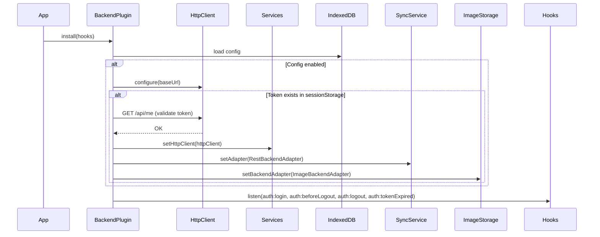
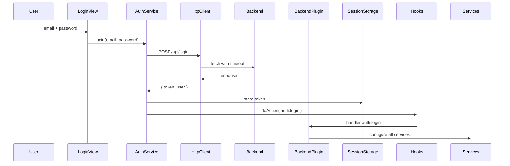
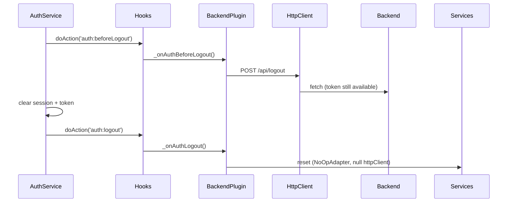
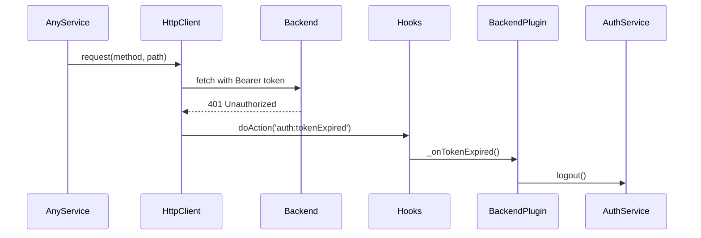

# BackendPlugin — Connexion frontend - backend Laravel

Plugin central qui connecte le Kanban frontend au backend Laravel. Active la synchronisation bidirectionnelle des boards, utilisateurs, taxonomies et images tout en maintenant le mode offline-first avec IndexedDB.

## Role

Plugin de wiring qui :

- Configure le BackendHttpClient centralise avec l'URL du backend
- Redirige UserService et TaxonomyService vers le backend via httpClient
- Active la synchronisation des boards via SyncService + RestBackendAdapter
- Synchronise les images via ImageBackendAdapter
- Gere le cycle auth (login, logout, token expire)
- Affiche un indicateur visuel de statut de sync

## Architecture

```
BackendPlugin/
+-- BackendPlugin.js          -- Orchestrateur principal (wiring)
+-- SyncIndicator.js          -- Indicateur visuel de statut sync
+-- ImageBackendAdapter.js    -- Adapteur upload/download images (via httpClient)
+-- settingsPanel.js          -- Panneau de configuration
+-- styles.js                 -- Styles CSS
+-- index.js                  -- Point d'entree (assemblage)
+-- manifest.json             -- Metadonnees plugin
+-- README.md                 -- Ce fichier
```

### Services centralises

```
BackendHttpClient (singleton)
|
+-- RestBackendAdapter    -- sync boards (pushOps, pullOps, etc.)
+-- ImageBackendAdapter   -- upload/download/delete images
+-- UserService           -- GET /api/users
+-- TaxonomyService       -- GET /api/taxonomies
+-- AuthService           -- POST /api/login (via httpClient)
+-- BackendPlugin         -- GET /api/me, POST /api/logout
```

Tous les appels HTTP authentifies passent par `BackendHttpClient` qui :
- Ajoute le token Bearer via `AuthService.getToken()`
- Gere le timeout via AbortController
- Intercepte les 401 et fire `auth:tokenExpired`

### Fichiers

#### `BackendPlugin.js`

Plugin principal qui :

- Charge la config depuis IndexedDB (`backend:config`)
- Ecoute les hooks `app:initialized`, `auth:login`, `auth:beforeLogout`, `auth:logout`, `auth:tokenExpired`
- Configure httpClient et les services au demarrage si un token existe (validation via GET /api/me)
- Switch le StorageDriver vers BackendStorageDriver (boards lus/ecrits via REST)
- Fournit l'API publique pour le settings panel (`getConfig`, `updateConfig`, `testConnection`)

#### `SyncIndicator.js`

Composant UI qui affiche une pastille de couleur indiquant le statut de synchronisation :

- **Gris** : backend non configure (mode local uniquement)
- **Vert** : connecte au backend, sync OK
- **Orange** : operations en attente de push (offline ou erreur temporaire)
- **Rouge** : erreur de sync persistante

Ecoute les hooks `sync:pushed`, `sync:queued`, `sync:pushFailed`.

#### `ImageBackendAdapter.js`

Adapteur specialise pour la synchronisation des images. Delegue le HTTP au BackendHttpClient :

- Upload multipart via `httpClient.upload('/api/boards/{boardId}/images', formData)`
- Download blob via `httpClient.requestRaw('GET', '/api/images/{imageId}')`
- Suppression via `httpClient.delete('/api/images/{imageId}')`

#### `settingsPanel.js`

Interface de configuration accessible depuis les settings de l'app :

- Champ URL du backend
- Toggle activer/desactiver
- Bouton "Tester la connexion" (appelle `GET /api/me` via httpClient)
- Champ intervalle de synchronisation (secondes)

## Activation

Quand l'utilisateur active le BackendPlugin depuis le panneau Plugins (`PluginsPanel`), une modale de confirmation s'affiche pour l'informer qu'il sera déconnecté. Si confirmé, le plugin est activé, un logout est effectué, et l'utilisateur est redirigé vers la page de login.

Ce comportement est implémenté dans `PluginsPanel._confirmBackendActivation()` via `ModalConfirmDelete` (avec un `confirmLabel` personnalisé).

## Fonctionnement

### Initialisation



### Login



### Logout



### StorageDriver

Quand les services sont configures, le plugin switch le driver de `StorageService` :

1. **Login** : `StorageService.setDriver(new BackendStorageDriver(httpClient))`
   - Toutes les operations board (list, create, load, save, delete, duplicate, rename) passent par l'API REST
   - Les settings et images restent en IndexedDB local
2. **Logout** : `StorageService.setDriver(new LocalStorageDriver())`
   - Retour au comportement par defaut (IndexedDB pur)

Le board actif est stocke comme setting local (`storage:activeBoard`) dans IndexedDB, independant du driver.

### Token expire (401)



## Persistence

### IndexedDB

Cle : `backend:config`
Store : `meta`

Structure :

```json
{
    "backendUrl": "http://localhost:8080",
    "pullInterval": 30000,
    "enabled": true
}
```

### SessionStorage

- `kanban:auth:token` : Token Sanctum (nettoye au logout)
- `kanban:auth:session` : Session user { userId }

## Comment modifier

### Ajouter un nouveau service backend

1. **Injecter httpClient dans le service**

    ```js
    // Dans le service
    setHttpClient(httpClient) {
        this._httpClient = httpClient;
    }
    ```

2. **Passer httpClient dans BackendPlugin._configureServices()**

    ```js
    MyService.setHttpClient(httpClient);
    MyService.reload();
    ```

3. **Nettoyer au logout dans _onAuthLogout()**
    ```js
    MyService.setHttpClient(null);
    ```

### Changer l'intervalle de pull par defaut

Dans `BackendPlugin.js` :

```js
const DEFAULT_CONFIG = {
    backendUrl: '',
    pullInterval: 60000, // 60 secondes au lieu de 30
    enabled: false,
};
```

### Ajouter un etat au SyncIndicator

Dans `SyncIndicator.js` :

```js
const STATES = {
    // ... etats existants
    WARNING: { color: '#fbbf24', label: 'Connexion instable' },
};

// Puis ecouter un nouveau hook
hooks.addAction('sync:connectionWarning', () => this._setState('WARNING'));
```

## Hooks

### Ecoutes

| Hook                | Declencheur                                 | Action                                            |
| ------------------- | ------------------------------------------- | ------------------------------------------------- |
| `app:initialized`   | Application.init()                          | Configure httpClient + services si token existe    |
| `auth:login`        | LoginView apres login reussi                | Configure tous les services                        |
| `auth:beforeLogout` | AuthService.logout() avant cleanup          | POST /api/logout via httpClient                    |
| `auth:logout`       | AuthService.logout() apres cleanup          | Reset services, adapteurs, flag _configured        |
| `auth:tokenExpired` | BackendHttpClient sur 401                   | Declenche AuthService.logout()                     |
| `board:didChange`   | BoardService change de board                | (Passif, gere par SyncService)                     |

Le plugin utilise aussi les hooks fournis par SyncService :

- `sync:pushed`
- `sync:queued`
- `sync:pushFailed`

## Endpoints backend attendus

### Auth

- `POST /api/register` -> 201 `{ user, message }` (public, pas de token)
- `POST /api/login` -> `{ token, user }`
- `POST /api/logout` -> 204
- `GET /api/me` -> `{ user }`

### Users

- `GET /api/users` -> `{ data: [...] }` (pagine)

### Taxonomies

- `GET /api/taxonomies` -> `[{ key, label, terms }]`

### Boards

- `GET /api/boards/registry` -> `[{ id, name, description, columnCount, cardCount, coverImageId, createdAt, updatedAt }]`
- `POST /api/boards/{id}/ops` -> `{ serverRevision }`
- `GET /api/boards/{id}/ops?since={rev}` -> `{ ops, serverRevision }`
- `GET /api/boards/{id}` -> board snapshot
- `PUT /api/boards/{id}` -> `{ serverRevision }`

### Images

- `POST /api/boards/{boardId}/images` -> 201 (multipart)
- `GET /api/images/{id}` -> blob (Content-Type: image/*)
- `DELETE /api/images/{id}` -> 204

## Securite

- Token Sanctum stocke dans **sessionStorage** (pas localStorage) -> deconnexion auto a la fermeture
- Toutes les requetes backend passent par BackendHttpClient (auth + timeout + 401)
- Interception 401 automatique -> logout + nettoyage complet
- Fallback local si backend injoignable -> zero regression offline
- Pas de credentials stockes en dur (hash SHA-256 cote client pour mode local uniquement)

## Troubleshooting

### Backend injoignable au demarrage

Le plugin detecte l'echec de validation du token et ne configure pas les services.
Verifier la console : `BackendPlugin: validation token echouee, services non configures`.

### Images non uploadees

- Verifier que `enabled: true` dans la config
- Verifier que le token est valide (`sessionStorage.getItem('kanban:auth:token')`)
- Inspecter la console pour les erreurs d'upload

### Sync ne demarre pas

- Verifier que `SyncService.setAdapter()` a bien ete appele
- Verifier `BackendPlugin: services configures avec http://...` dans la console
- Verifier que l'indicateur n'est pas gris (si gris, backend desactive)

### CORS errors

Verifier dans `backend/config/cors.php` :

```php
'allowed_origins' => [env('FRONTEND_URL', 'http://localhost:5173')],
'supports_credentials' => true,
```

Et dans `.env` :

```
FRONTEND_URL=http://localhost:5173
```
