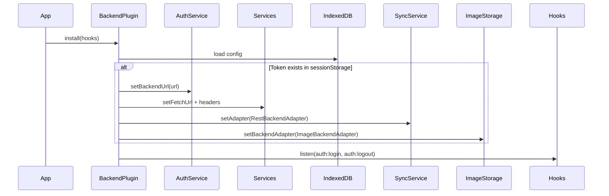
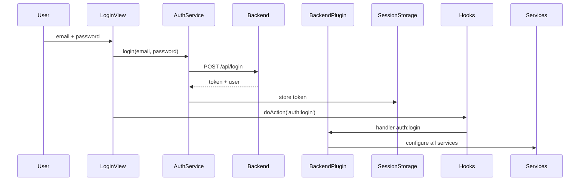
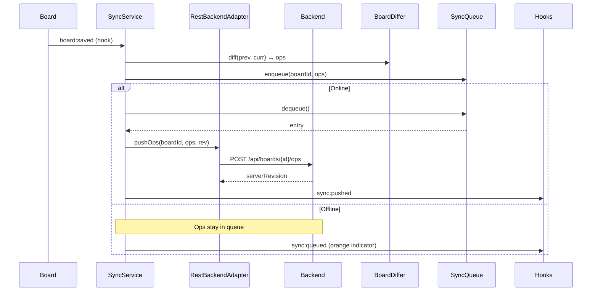

# BackendPlugin — Connexion frontend ↔ backend Laravel

Plugin central qui connecte le Kanban frontend au backend Laravel. Active la synchronisation bidirectionnelle des boards, utilisateurs, taxonomies et images tout en maintenant le mode offline-first avec IndexedDB.

## Rôle

Orchestrateur de connexion backend qui :

- Configure AuthService pour l'authentification Sanctum
- Redirige UserService et TaxonomyService vers le backend
- Active la synchronisation des boards via SyncService
- Synchronise les images vers le serveur
- Affiche un indicateur visuel de statut de sync

## Architecture

```
BackendPlugin/
├── BackendPlugin.js          — Orchestrateur principal
├── SyncIndicator.js          — Indicateur visuel de statut sync
├── ImageBackendAdapter.js    — Adapteur upload/download images
├── settingsPanel.js          — Panneau de configuration
├── styles.js                 — Styles CSS
├── index.js                  — Point d'entrée (assemblage)
├── manifest.json             — Métadonnées plugin
└── README.md                 — Ce fichier
```

### Fichiers

#### `BackendPlugin.js`

Plugin principal qui :

- Charge la config depuis IndexedDB (`backend:config`)
- Écoute les hooks `app:initialized`, `auth:login`, `auth:logout`
- Configure les services (Auth, User, Taxonomy, Sync, Images) au démarrage si un token existe
- Fournit l'API publique pour le settings panel (`getConfig`, `updateConfig`, `testConnection`)

#### `SyncIndicator.js`

Composant UI qui affiche une pastille de couleur indiquant le statut de synchronisation :

- **Gris** : backend non configuré (mode local uniquement)
- **Vert** : connecté au backend, sync OK
- **Orange** : opérations en attente de push (offline ou erreur temporaire)
- **Rouge** : erreur de sync persistante

Écoute les hooks `sync:pushed`, `sync:queued`, `sync:pushFailed`.

#### `ImageBackendAdapter.js`

Adapteur spécialisé pour la synchronisation des images :

- Upload multipart/form-data vers `POST /api/boards/{boardId}/images`
- Download depuis `GET /api/images/{imageId}`
- Suppression via `DELETE /api/images/{imageId}`

#### `settingsPanel.js`

Interface de configuration accessible depuis les settings de l'app :

- Champ URL du backend
- Toggle activer/désactiver
- Bouton "Tester la connexion" (appelle `GET /api/me`)
- Champ intervalle de synchronisation (secondes)

## Fonctionnement

### Initialisation



### Login



### Sync Board



## Persistence

### IndexedDB

Clé : `backend:config`  
Store : `meta`

Structure :

```json
{
    "backendUrl": "http://localhost:8080",
    "pullInterval": 30000,
    "enabled": true
}
```

### SessionStorage

- `kanban:auth:token` : Token Sanctum (nettoyé au logout)
- `kanban:auth:session` : Session user { userId }

## Comment modifier

### Ajouter un nouveau service backend

1. **Créer un adapteur si nécessaire**

    ```js
    // Dans BackendPlugin/ ou services/
    export default class MyServiceAdapter {
        constructor({ baseUrl, getHeaders }) { ... }
        async fetchData() { ... }
    }
    ```

2. **Injecter dans BackendPlugin.\_configureServices()**

    ```js
    const adapter = new MyServiceAdapter({
        baseUrl: this._config.backendUrl,
        getHeaders,
    });
    MyService.setAdapter(adapter);
    ```

3. **Nettoyer au logout dans \_onAuthLogout()**
    ```js
    MyService.setAdapter(null);
    ```

### Changer l'intervalle de pull par défaut

Dans `BackendPlugin.js` :

```js
const DEFAULT_CONFIG = {
    backendUrl: '',
    pullInterval: 60000, // 60 secondes au lieu de 30
    enabled: false,
};
```

### Ajouter un état au SyncIndicator

Dans `SyncIndicator.js` :

```js
const STATES = {
    // ... états existants
    WARNING: { color: '#fbbf24', label: 'Connexion instable' },
};

// Puis écouter un nouveau hook
hooks.addAction('sync:connectionWarning', () => this._setState('WARNING'));
```

### Modifier l'apparence de l'indicateur

Dans `styles.js`, modifier `.sync-indicator` :

```css
.sync-indicator {
    position: fixed;
    bottom: 1rem;
    right: 1rem;
    /* ... */
}
```

## Hooks

### Écoutés

| Hook              | Déclencheur                  | Action                                 |
| ----------------- | ---------------------------- | -------------------------------------- |
| `app:initialized` | Application.init()           | Configure les services si token existe |
| `auth:login`      | LoginView après login réussi | Configure tous les services            |
| `auth:logout`     | AuthService.logout()         | Désactive sync, nettoie config         |
| `board:didChange` | BoardService change de board | (Passif, géré par SyncService)         |

### Fournis

Aucun. Le plugin utilise les hooks fournis par SyncService :

- `sync:pushed`
- `sync:queued`
- `sync:pushFailed`

## Endpoints backend attendus

### Auth

- `POST /api/login` → `{ token, user }`
- `POST /api/logout` → 204
- `GET /api/me` → `{ user }`

### Users

- `GET /api/users` → `{ data: [...] }` (paginé)

### Taxonomies

- `GET /api/taxonomies` → `[{ key, label, terms }]`

### Boards

- `POST /api/boards/{id}/ops` → `{ serverRevision }`
- `GET /api/boards/{id}/ops?since={rev}` → `{ ops, serverRevision }`
- `GET /api/boards/{id}` → board snapshot
- `PUT /api/boards/{id}` → `{ serverRevision }`

### Images

- `POST /api/boards/{boardId}/images` → 201 (multipart)
- `GET /api/images/{id}` → blob (Content-Type: image/\*)
- `DELETE /api/images/{id}` → 204

## Sécurité

- Token Sanctum stocké dans **sessionStorage** (pas localStorage) → déconnexion auto à la fermeture
- Toutes les requêtes backend incluent `Authorization: Bearer {token}`
- Fallback local si backend injoignable → zéro régression offline
- Pas de credentials stockés en dur (hash SHA-256 côté client pour mode local uniquement)

## Troubleshooting

### Backend injoignable au démarrage

Le plugin détecte l'échec et bascule en mode local silencieusement.  
Vérifier la console : `AuthService: backend injoignable, fallback mode local`.

### Images non uploadées

- Vérifier que `enabled: true` dans la config
- Vérifier que le token est valide (`sessionStorage.getItem('kanban:auth:token')`)
- Inspecter la console pour les erreurs d'upload

### Sync ne démarre pas

- Vérifier que `SyncService.setAdapter()` a bien été appelé
- Vérifier `BackendPlugin: services configurés avec http://...` dans la console
- Vérifier que l'indicateur n'est pas gris (si gris, backend désactivé)

### CORS errors

Vérifier dans `backend/config/cors.php` :

```php
'allowed_origins' => [env('FRONTEND_URL', 'http://localhost:5173')],
'supports_credentials' => true,
```

Et dans `.env` :

```
FRONTEND_URL=http://localhost:5173
```
